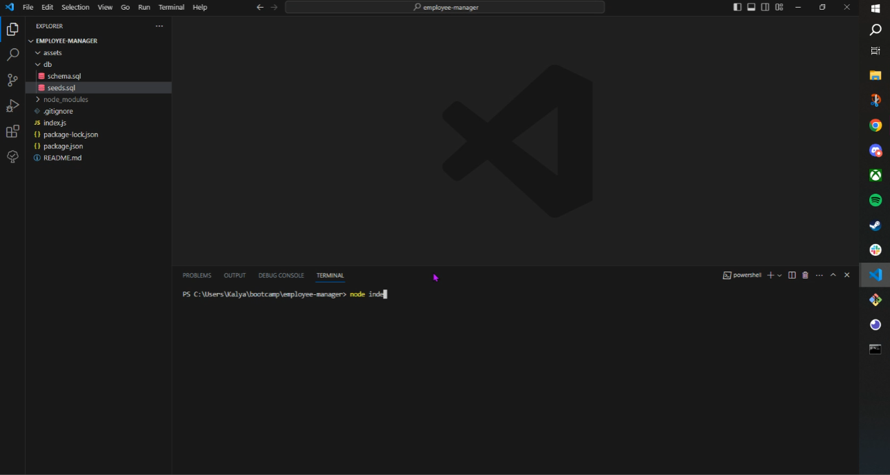

# Employee Manager

## Table of Contents

- [Description](#description)
- [Installation](#installation)
- [Usage](#usage)
- [Contact Me](#contact-me)

## Description

This is a mySQL2 application that can manage a database of employees and their associated roles and departments. The user can access the database and view all of the various departments, roles and employees that are part of this company.

## Installation

To use this application the user will need to run "npm i" in the terminal.

## Usage

When this application is running the user will be prompted with 7 options, "View all departments", "View all roles", "View all employees", "Add a department", "Add a role", "Add an employee" and "Update an employee role". When the user selects "View all departments", a table with the departments and their associated IDs will be displayed in the terminal. When the user selects "View all roles", a table with the roles, salaries and their associated department IDs will be displayed in the terminal. When the user selects "View all employees", a table with the employee's first name, last name, role ID and their manager ID will be displayed in the terminal. When the user selects "Add a department", they will be prompted with a question asking for the name of the new department and "New department added" will log in the console upon completion. When the user selects "Add a role", they will be asked for the name of the new role, what the salary will be and what department it will be a part of and "New role added" will be logged in the console upon completion. When the user selects "Add an employee", they will be prompted questions for the new employee's first name, last name, the department they will be in, their role and their manager and "New employee added" will be logged in the console upon completion. Lastly, when the user selects "Update an employee role", they will be prompted with questions for the name of the employee and the role they will be changing to and "Employee updated" will be logged in the console upon completion.

## Contact Me

For any questions, please contact me via the channels below:
* Github: https://github.com/kaylaasana
* E-mail: kayladatte@gmail.com
